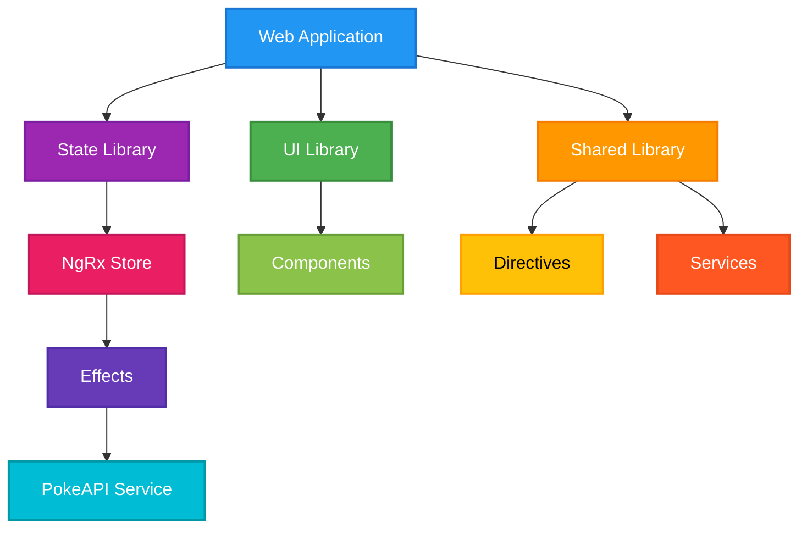
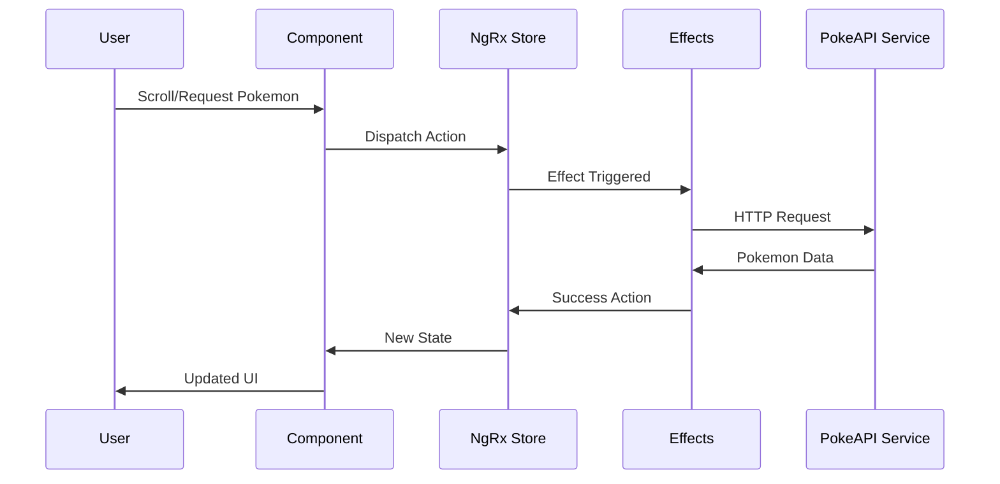

# PokeAPI Angular Application

A modern Angular application that showcases Pokemon data from the PokeAPI, built with a scalable architecture using Nx workspace and following best practices.

## Features

- ✨ Pokemon listing with infinite scroll
- 🖼️ Beautiful Pokemon cards with images and details
- 🏗️ Smart state management with NgRx
- 🎯 Modular architecture with smart containers and presentational components
- 💅 Modern UI with Tailwind CSS
- 🔄 Efficient data fetching and caching
- 📱 Responsive design

## Architecture Overview



### Data Flow



## Project Structure

This project uses Nx workspace and follows a modular architecture:

- `apps/web`: Main application
  - Pages
  - Routing
  - App configuration
- `libs/ui`: Reusable UI components
  - Pokemon cards
  - Buttons
  - Common UI elements
- `libs/state`: State management
  - NgRx store
  - Effects
  - Selectors
  - Actions
- `libs/shared`: Shared utilities
  - Services
  - Interfaces
  - Directives (e.g., Infinite scroll)

## Technical Stack

- **Framework**: Angular 17+
- **State Management**: NgRx
- **CSS**: TailwindCSS
- **Build Tool**: Nx
- **Architecture**: Smart Containers/Dumb Components
- **API**: PokeAPI (https://pokeapi.co/)

## Development Setup

To run the development server:

```sh
npx nx serve web
```

To create a production build:

```sh
npx nx build web
```

## Development Guidelines

- Follow functional programming principles
- Maintain separation between smart containers and presentational components
- Write clean, testable code
- Follow Angular best practices and style guide
- Use NgRx for state management
- Implement proper error handling
- Write unit tests for components and services

## Available Scripts

```sh
# Build all projects
npm run build

# Build web application
npm run build:web

# Build UI library
npm run build:ui

# Run all tests
npm run test

# Run end-to-end tests
npm run test:e2e

# Start development server
npm run start

# Run Storybook development server
npm run storybook

# Build Storybook static files
npm run storybook:build

# Serve Storybook
npm run storybook:serve

# Generate new components/services (Nx commands)
npx nx g @nx/angular:component
npx nx g @nx/angular:service
```

## Contributing

1. Fork the repository
2. Create your feature branch (`git checkout -b feature/amazing-feature`)
3. Commit your changes (`git commit -m 'Add some amazing feature'`)
4. Push to the branch (`git push origin feature/amazing-feature`)
5. Open a Pull Request

## Learn More

- [Angular Documentation](https://angular.dev)
- [NgRx Documentation](https://ngrx.io)
- [Nx Documentation](https://nx.dev)
- [TailwindCSS Documentation](https://tailwindcss.com)
- [PokeAPI Documentation](https://pokeapi.co/docs/v2)
